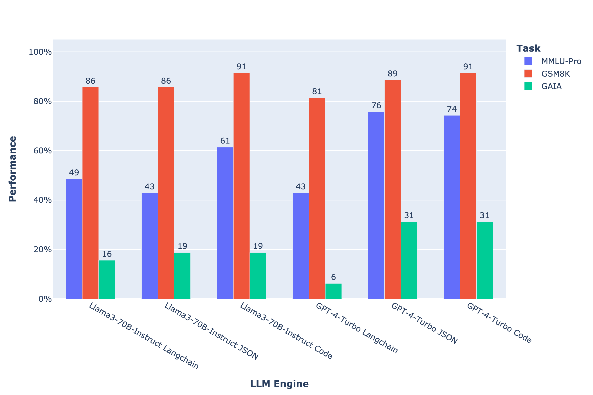

# Benchmark agent workflows: try the models of your choice on the framework that you want

This repo is the engine for the evaluations displayed in our [Agents v2.0](https://huggingface.co/blog/agents) announcement post.

You can use it to test agents on different frameworks:
- [LangChain](https://github.com/langchain-ai/langchain)
- [Transformers agents](https://huggingface.co/docs/transformers/en/transformers_agents)

On different benchmarks:
- [GAIA](https://huggingface.co/papers/2311.12983)
- our [custom agent reasoning benchmark](https://huggingface.co/datasets/m-ric/agents_small_benchmark) that includes tasks from GSM8K, HotpotQA and GAIA

And with different models (cf benchmark below).

We also implement LLM-judge evaluation, with parallel processing for faster results.

